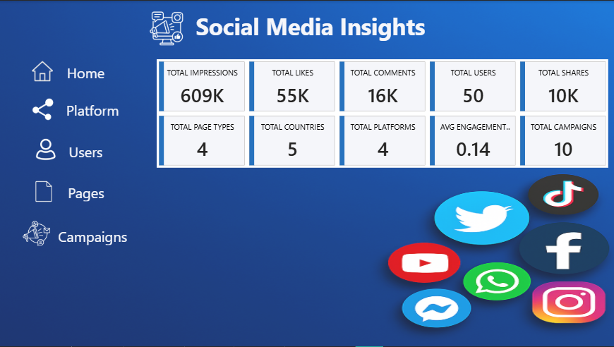
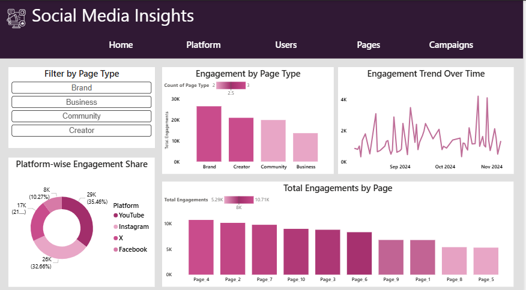
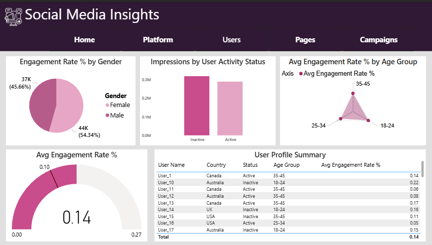
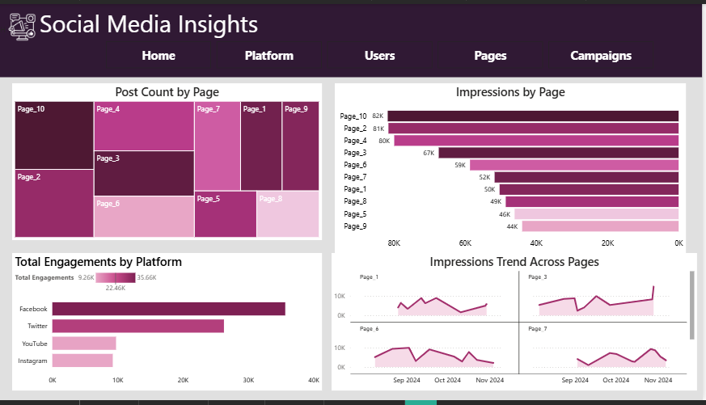
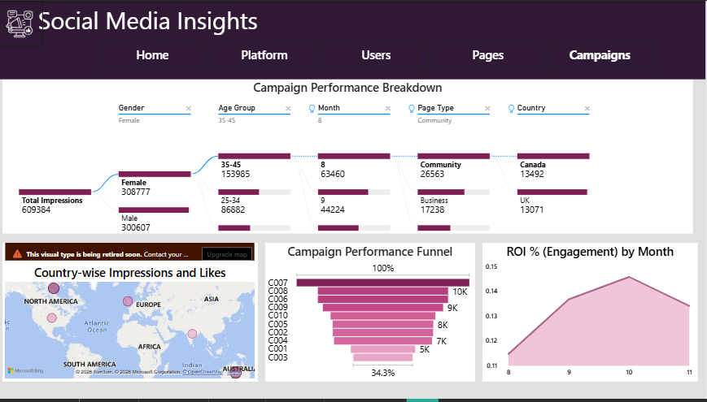

# 📊 Social Media Insights – Power BI Dashboard

A multi-page interactive Power BI dashboard analyzing social media performance 
across platforms, pages, users, and campaigns.

---

## 📌 Key Metrics
- **Total Impressions:** 609K  
- **Total Likes:** 55K  
- **Total Comments:** 16K  
- **Total Shares:** 10K  
- **Platforms Covered:** YouTube, Instagram, Facebook, Twitter  
- **Total Campaigns:** 10  

---

## 📄 Pages Overview

| Page | Description |
|------|-------------|
| Home | KPI summary cards with key metrics |
| Platform | Engagement breakdown by platform |
| Users | Gender, age group, and engagement rate analysis |
| Pages | Post count, impressions, and trends by page |
| Campaigns | Campaign funnel, ROI by month, and geo map |

---

## 🖼️ Dashboard Preview

### 🏠 Home

### 📱 Platform Analysis

### 👤 User Insights

### 📄 Pages Performance

### 📣 Campaign Performance

---

## 🛠️ Tools Used
- Power BI Desktop
- DAX (Data Analysis Expressions)
- Power Query (M Language)
- Star Schema Data Modeling

---

## 👤 Author
**Pamidi Reddy Lakshmi**  
Fresher | Power BI Developer & Data Analyst  
[LinkedIn](https://linkedin.com/in/reddy-lakshmi-06502825a) | [GitHub](https://github.com/reddylakshmi13)
